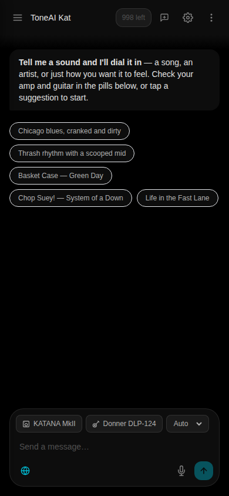
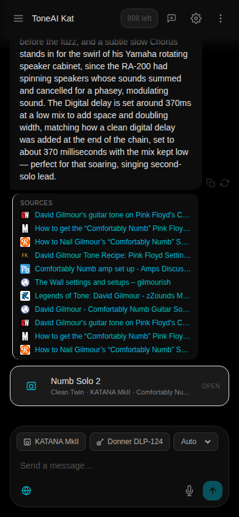
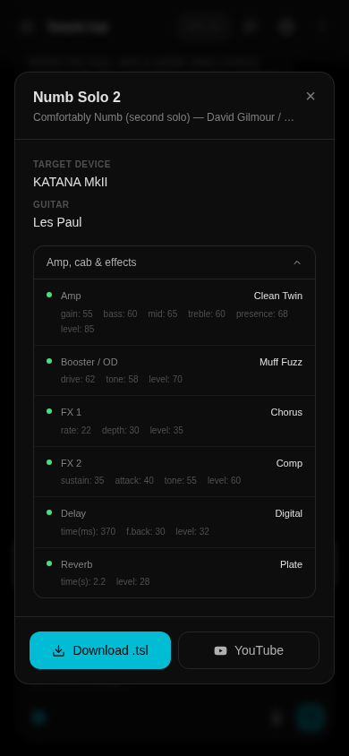
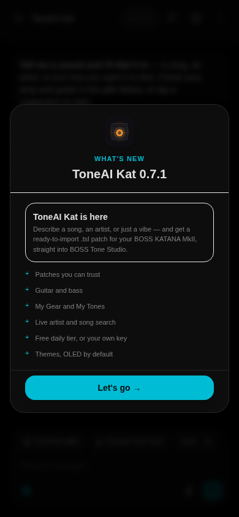
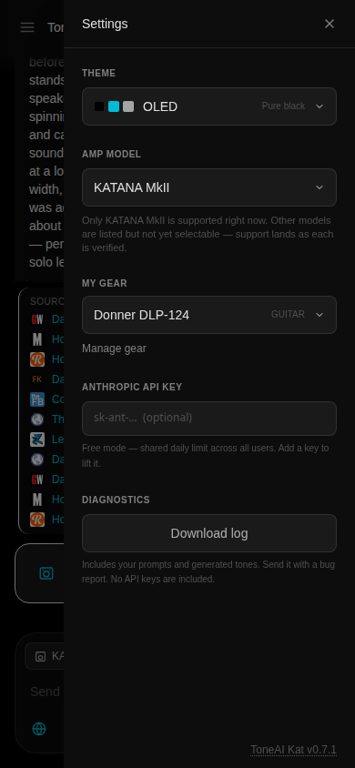
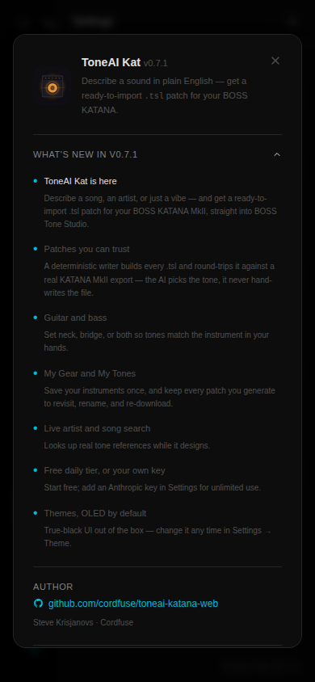
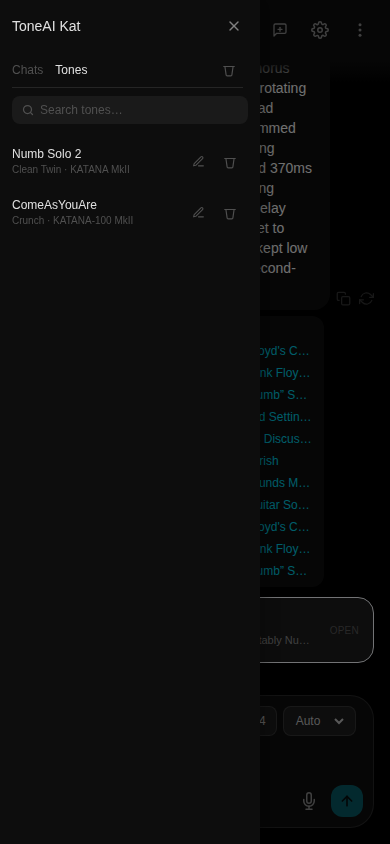
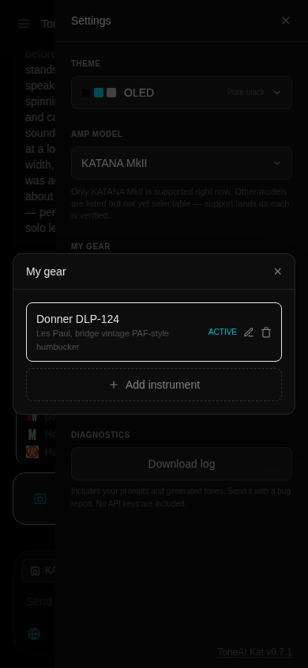

# ToneAI Kat

**AI tone patches for the BOSS KATANA.** Describe a song, an artist, or just a
vibe — ToneAI Kat designs the tone and hands you a ready-to-import `.tsl` patch
for BOSS Tone Studio.

<p align="center">
  
  
  
</p>

---

## What it does

- **Plain-English tone design.** "Gilmour's *Comfortably Numb* second solo" →
  a full amp / cab / effects chain, dialled and explained.
- **Real, importable patches.** Every tone downloads as a `.tsl` liveset you
  open in BOSS Tone Studio and send to the amp. The KATANA has no QR-import
  path — the file *is* the delivery mechanism.
- **Grounded in real references.** Live web search pulls actual artist and song
  tone write-ups while the model designs.
- **Your gear, remembered.** Save your instruments in *My Gear* (make, model,
  pickups) and the model tailors tones to what you actually play — guitar or
  bass, neck/bridge/both.
- **My Tones.** Every patch you generate is saved to revisit, rename, and
  re-download.
- **Free daily tier, or bring your own key.** Start free on a shared daily
  quota; add your own Anthropic API key in Settings for unlimited use. Your key
  is sent per-request and never stored or logged.
- **Themes, OLED by default.** A true-black UI out of the box, plus an
  amp-inspired palette (tweed, amber, British, oxblood, and more).

## The one rule that matters

**The model never writes a `.tsl` directly.** It fills in a constrained
tone-intent schema (amp type, gain, EQ, the booster / mod / fx / delay / reverb
chain), and a **deterministic writer** converts that intent into the liveset —
building from a golden template that round-trips byte-clean against a real
export for **every** supported device. A patch the amp rejects is worse than no patch
at all.

```
"Comfortably Numb, second solo"
        ↓
  model selects amp, gain, EQ, and the
  booster / mod / fx / delay / reverb chain   (constrained intent schema)
        ↓
  deterministic writer  →  KATANA MkII liveset  →  patch.tsl
        ↓
  import in BOSS Tone Studio  →  amp
```

## Supported devices

The `.tsl` format is **generation-scoped**: the 50 / 100 / Head / Artist
variants within a generation write a byte-identical patch — they differ in
hardware (wattage, speaker, cab), not patch data. So the picker lists **one
entry per generation**.

The full BOSS KATANA lineup is supported — **9 devices, every writer verified
byte-clean against a real export.** Each writer is proven by round-tripping a
genuine liveset before a single patch ships (`a patch the amp rejects is worse
than no patch`).

| Device | Instrument | Status |
|---|---|---|
| **KATANA MkI** | Guitar | Supported — the original 2019 KATANA; its own "GT" named-parameter liveset ([docs](docs/mk1-format-notes.md)) |
| **KATANA MkII** | Guitar | Supported ([docs](docs/tsl-format.md)) |
| **KATANA Gen 3** | Guitar | Supported ([docs](docs/gen3-format-notes.md)) |
| **KATANA:AIR** | Guitar | Supported — effects-only; amp delivered as hand-dial instructions ([docs](docs/air-format-notes.md)) |
| **KATANA:GO** | Guitar | Supported ([docs](docs/go-format-notes.md)) |
| **KATANA:GO Bass** | Bass | Supported ([docs](docs/go-format-notes.md)) |
| **KATANA Bass** | Bass | Supported — desktop 110 / 210 / Head ([docs](docs/katana-bass-format-notes.md)) |
| **WAZA-AIR** | Guitar | Supported — wireless headphone amp, effects-only ([docs](docs/waza-air-format-notes.md)) |
| **WAZA-AIR Bass** | Bass | Supported — wireless headphone amp, effects-only ([docs](docs/waza-air-format-notes.md)) |

Within a generation the 50 / 100 / Head / Artist variants write a byte-identical
patch — they differ in hardware (wattage, speaker, cab), not patch data — so the
picker lists one entry per generation, not per cabinet.

### Guitar and bass are separate

The amp you pick sets the patch **format**; the instrument in *My Gear* sets the
**voicing**. A guitar amp is universal — play a guitar or a bass through it and
the tone is voiced accordingly. A bass amp only voices bass, so pairing it with a
guitar is blocked rather than producing a patch that makes no sense.

### Convert between amps

A tone designed for one amp can be **converted to another you own** — open it,
and if it targets a different KATANA than you play, convert it for your amp.
Conversion stays within an instrument: guitar-to-guitar or bass-to-bass, never
across (a guitar tone isn't re-voiced for a bass rig). Knobs carry across
unchanged; amp and effect names are remapped to the target's vocabulary (Gen 3's
six amp characters vs. MkII's larger set), and an effect with no counterpart is
dropped rather than written as something the amp would reject. The converted
patch is saved to *My Tones* as its own entry.

## Screenshots

| Welcome | Settings | About |
|---|---|---|
|  |  |  |

| My Tones | My Gear | Tone detail |
|---|---|---|
|  |  |  |

## Stack

- **Next.js 15** (App Router) + **React 19**, TypeScript
- **Vercel AI SDK** with **`@ai-sdk/anthropic`** — Anthropic-only; tone design
  runs on Claude, with Anthropic's native web search
- **`node:sqlite`** (`DatabaseSync`, Node 24+, no experimental flags) for device
  auth, the daily quota, and diagnostics — no external database
- Stateless **device JWT** auth
- Docker (standalone build) behind Caddy

## Run it locally

```bash
cd nodejs
npm install
cp .env.example .env.local     # set JWT_SECRET and ANTHROPIC_API_KEY
npm run dev                     # http://localhost:3000
npm test                        # node:test suite
```

Node 24+ is required (`node:sqlite`).

## Deploy (Docker)

Three compose files under `docker/`, pick the one that matches your host:

| File | Use |
|---|---|
| `docker-compose.yml` | Direct port exposure (`localhost:3008`), no proxy |
| `docker-compose.prod.yml` | Caddy edge with automatic HTTPS for a public domain |
| `docker-compose.internal-caddy.yml` | Join an existing host reverse proxy on a shared network |

```bash
cd docker
cp .env.example .env            # fill in secrets
docker compose up -d --build
```

The build context is the repo root and the Dockerfile lives at
`docker/Dockerfile` (so `.tsl` config and `VERSION` resolve). On a
platform-managed deploy (e.g. Render), set **Dockerfile Path** to
`./docker/Dockerfile` and leave the root directory blank.

### Environment

| Variable | Required | Default | Notes |
|---|---|---|---|
| `JWT_SECRET` | **yes** | — | Signs device tokens. `openssl rand -base64 32` |
| `ANTHROPIC_API_KEY` | for free tier | — | Powers the shared free daily quota. Unset = BYOK only |
| `FREE_DAILY_LIMIT` | no | `100` | Global daily free-tier ceiling, shared by everyone — **this is the budget cap**. A served tone costs ~$0.03, so 100/day ≈ $3/day. Resets midnight UTC |
| `FREE_DEVICE_DAILY_LIMIT` | no | `10` | What one device may take from that pool per day — the fairness cap, so one visitor can't drain the day for everyone. Kept at 10% of the pool |
| `TONEAI_WEB_SEARCH_MAX_USES` | no | `2` | Max web searches per response (clamped 1–10). Search always-on; this is the per-request cost cap |
| `TONEAI_MODEL` | no | `claude-haiku-4-5` | Free-tier tone-design model. Operator-only — a free-tier client cannot pick a model (it spends this key). **BYOK users can**, from the `config/providers.yaml` allow-list, since their own key pays |
| `TONEAI_TEMPERATURE` | no | `1.0` | Sampling temperature. Operator-only — there is no per-chat override |
| `TONEAI_CONFIG_DIR` | no | bundled | Where branding / themes config is read from |

The SQLite DB lives at `data/katana.db`. On an ephemeral-filesystem host, mount
a persistent volume at `/app/data` so device auth and quota survive deploys.

See [`docker/.env.example`](docker/.env.example) for the full annotated list.

## Format docs

- [docs/kat-format.md](docs/kat-format.md) — the `.kat` binary format, per
  generation, and what's verified vs. assumed
- [docs/tsl-format.md](docs/tsl-format.md) — the `.tsl` liveset JSON envelope
- [docs/settings.md](docs/settings.md) — parameter map behind the tone intent

## Sibling projects

| Repo | Amp | Delivery |
|---|---|---|
| `cordfuse/toneai-katana-web` | BOSS KATANA | `.tsl` file |
| `cordfuse/toneai-nux-cli` | NUX MightyAmp | QR code |
| `cordfuse/toneai-nux-imprint` | NUX MightyAmp | conversational agent |

## Licence

MIT — Steve Krisjanovs, Cordfuse.
